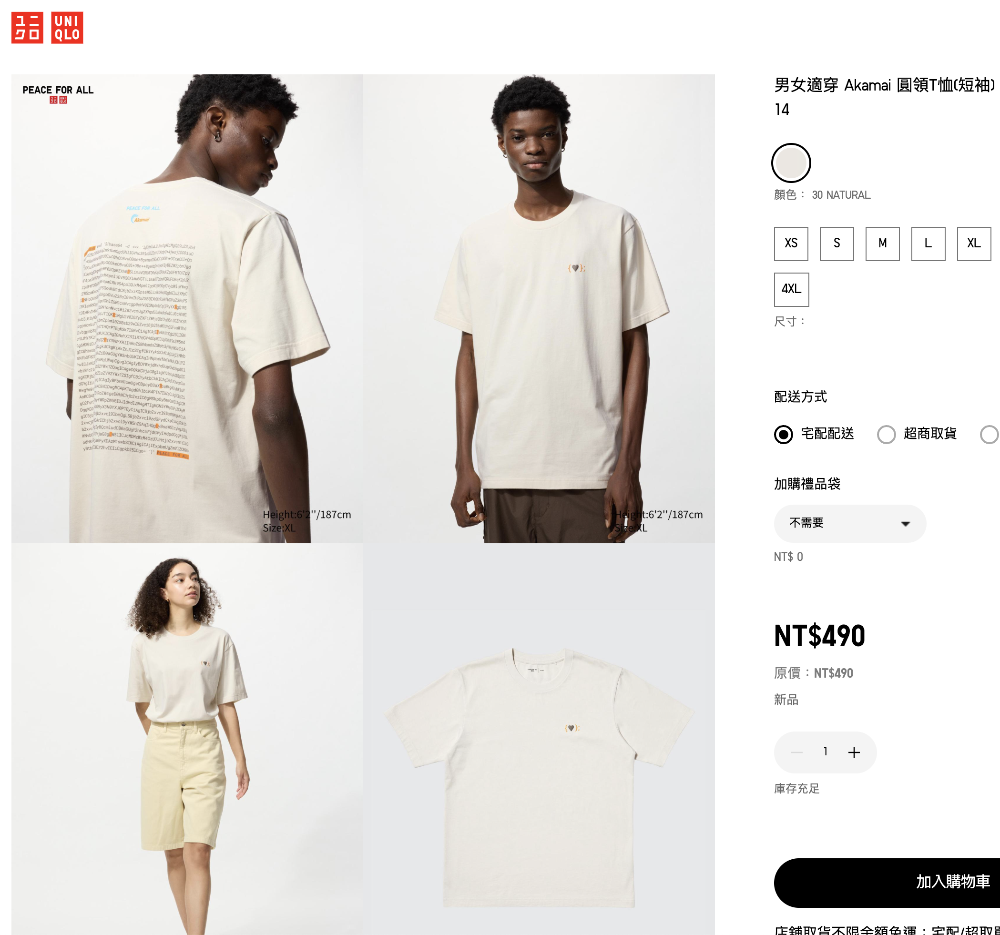
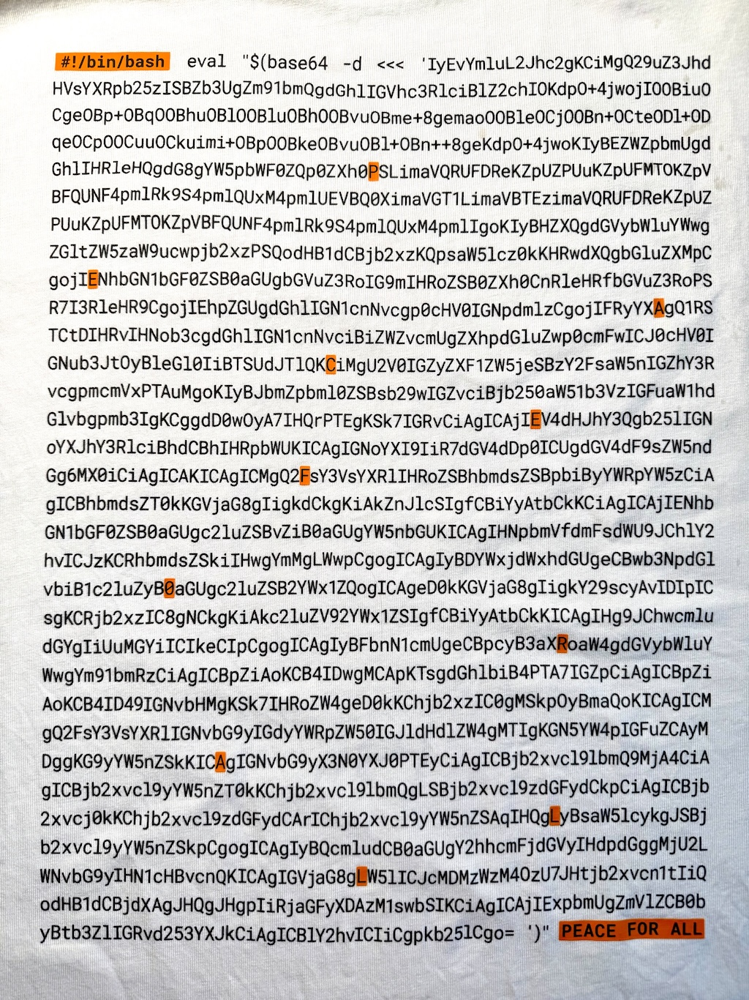

# UNIQLO Akamai T-shirt Code (2025 bash edition)

## Overview
A Japanese fashion brand called UNIQLO collaborated with an Internet company called Akamai to design a T-shirt.

The design of the T-shirt is based on bash code encoded in [base64](https://en.wikipedia.org/wiki/Base64).

You can run `Akamai.sh` or `source.sh` in any Unix-like command line by:

`./Akamai.sh`

OR

`./source.sh`

## T-shirt's Design

## T-shirt's Code

## Output Animation

## Enjoy your easter egg! ❤️
## 💙 PEACE 🧡 FOR 💛 ALL 💚
